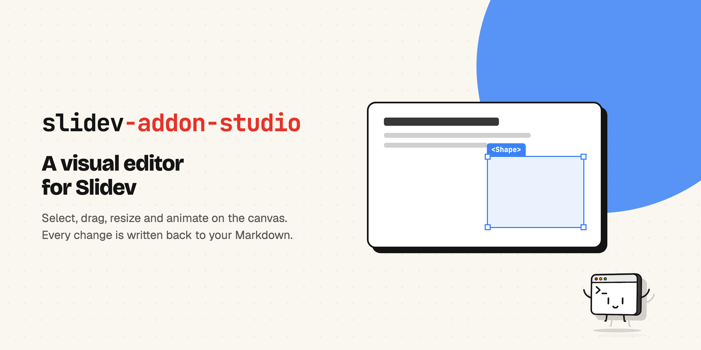
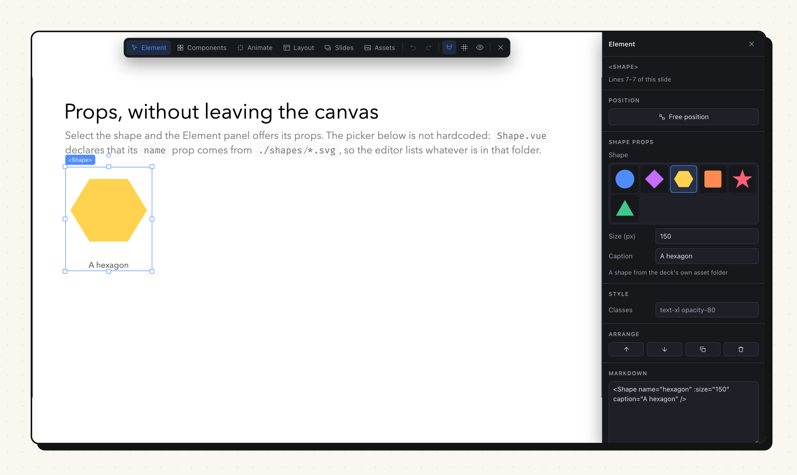
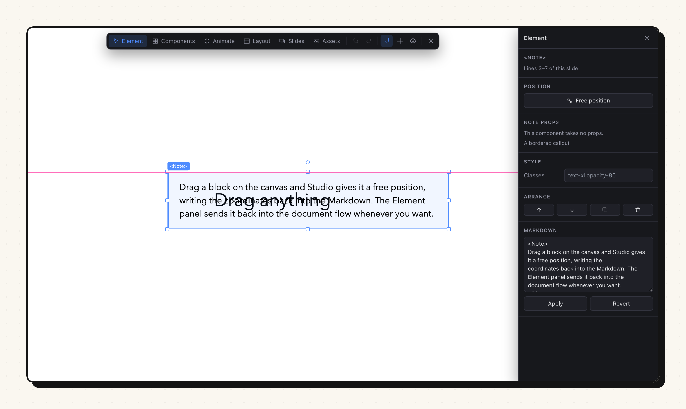
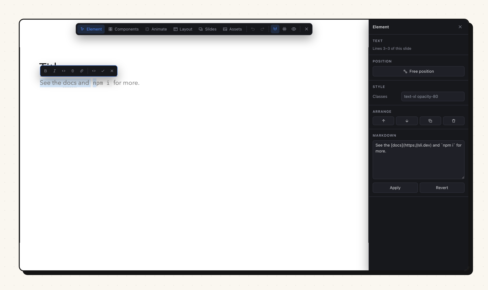
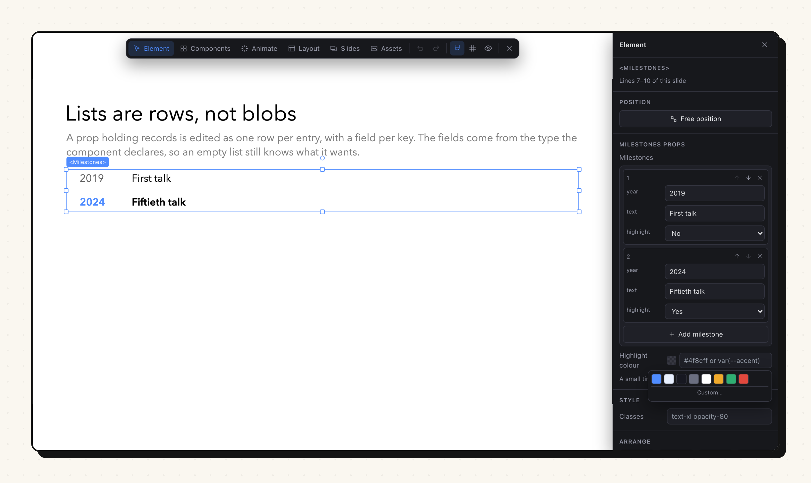
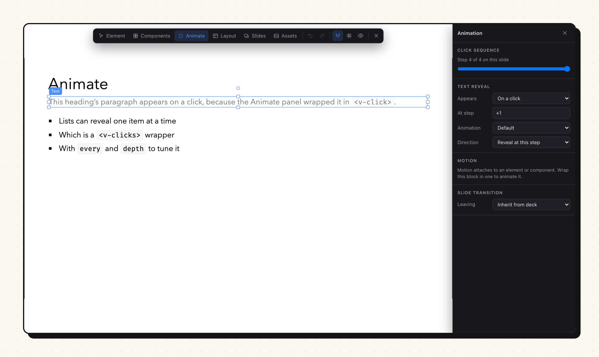
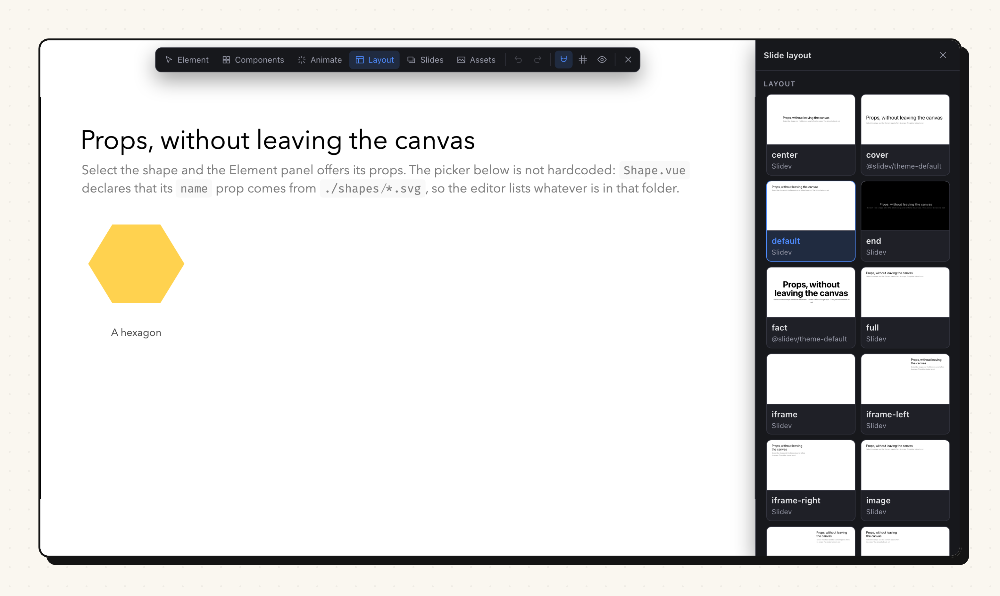
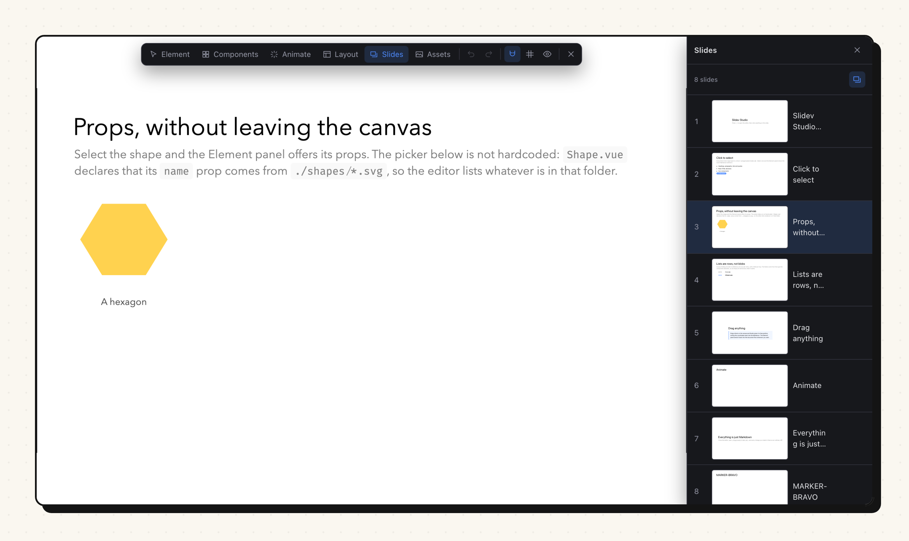
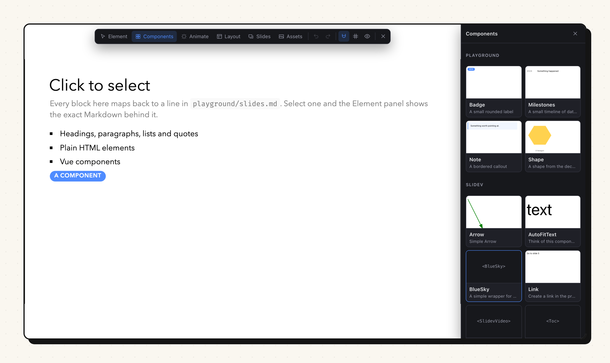

# slidev-addon-studio



A visual editor for [Slidev](https://sli.dev). Select, drag, resize, animate and
compose slides directly on the canvas, the way you would in Keynote or
PowerPoint, while the deck stays exactly what it was: a Markdown file.



**Markdown is the source of truth.** Every action in Studio is a small, readable
edit to your `.md` file. There is no project format, no database and no lock-in.
Close the editor and the diff is something you could have typed by hand. That
constraint is the point: it is what lets a visual editor coexist with version
control, code review and hand editing.

## Install

```bash
pnpm add -D slidev-addon-studio
```

Then enable it in your deck's headmatter:

```yaml
---
addons:
  - slidev-addon-studio
---
```

or in `package.json`, which applies it to every deck in the project:

```json
{
  "slidev": {
    "addons": ["slidev-addon-studio"]
  }
}
```

Start `slidev` as usual and press <kbd>E</kbd>, or use the pencil button in
Slidev's bottom bar. Studio adds nothing to the slide while it is closed.

## What it does

| Panel | What it edits |
| --- | --- |
| **Element** | Position, size, rotation, component props, utility classes, order, duplicate, delete, and the raw Markdown of the selection |
| **Components** | Markdown basics plus every component this deck can use, with live previews. Click to insert, drag onto the canvas to place freely |
| **Animate** | Click steps, reveal and hide, entrance animations, staggered lists, motion presets, slide transitions |
| **Layout** | The layout, with a live thumbnail of each one, the frontmatter keys that layout reads, and the slide's title, classes, background, zoom, click count and notes |
| **Slides** | Live thumbnails, drag to reorder, add, duplicate and delete |
| **Assets** | Drop images into `public/` and insert them |

### Selecting and moving

Click anything on the slide. Studio traces the rendered element back to the
exact lines of Markdown it came from and shows them in the Element panel.

Drag the selection and the block leaves the document flow: Studio wraps it in
Slidev's own `v-drag`, so the position is written into the Markdown as
`pos="x,y,w,h"` in slide canvas units. Handles resize, the top handle rotates,
and <kbd>Backspace</kbd> deletes. "Return to flow" in the Element panel undoes
the free positioning.

Elements snap to the canvas edges, its centre and thirds, and to the edges and
centres of everything else on the slide. Hold <kbd>Alt</kbd> to place something
exactly where you want it instead.



A move of an element that is already free is written straight into its `pos`,
without rebuilding the slide, so dragging stays as smooth as Slidev's own
handles. Only the first drag of a block in the document flow re-renders it,
because that one changes the Markdown's shape rather than four numbers in it.

### Editing text

Double-click any block and it becomes editable where it sits, with a toolbar for
bold, italic, code, strikethrough, links, headings, lists and quotes.

What is edited is the block's Markdown, not its rendered HTML, which is why a
table or a fenced code block is editable too: to this editor they are text like
everything else. It is also why the toolbar can be trusted. Round-tripping
rendered HTML back into Markdown is where visual editors lose components,
directives and formatting, and a Slidev deck is full of all three.



<kbd>Ctrl</kbd> + <kbd>Enter</kbd> applies, <kbd>Esc</kbd> cancels,
<kbd>Ctrl</kbd> + <kbd>B</kbd> and <kbd>Ctrl</kbd> + <kbd>I</kbd> do what you
expect.

### Editing props

Select a component and the Element panel becomes a form for it, built from the
component's own props. Numbers are written bound (`:size="140"`), enumerated
strings plainly (`color="red"`), and options backed by image files get a picker
that shows the images.

A prop that holds records is edited as one row per entry with a field per key,
typed from the element type the component declares, so an empty list still knows
what fields it wants. A prop that holds a colour offers the deck's own palette,
read from the custom properties in your theme's stylesheets, so picking one
keeps the slide pointing at `var(--accent)` rather than freezing a hex.



### Animating

Slidev's animation model is a sequence of click steps per slide, so the Animate
panel leads with that sequence and lets you scrub it.



Studio writes whichever form fits the block:

```md
<!-- an element or component takes the directive -->
<Pill v-click.fade="2">Later</Pill>

<!-- a Markdown block gets a wrapper, which renders no extra element -->
<v-click>

# A heading that appears on click

</v-click>

<!-- a list can reveal one item at a time -->
<v-clicks every="2">

- One
- Two

</v-clicks>
```

### Choosing a layout

A layout is picked from thumbnails rather than from a list of names. Each one
renders the layout at full slide size with this slide's own frontmatter, title
and lead line, then scales it down, so what you compare is the composition you
would get.



A layout's props are the frontmatter keys it reads, and they are edited in the
same panel. On a slide like `layout: fact`, whose entire visible text lives in
`value:` and `label:`, that panel is the only place to edit it: none of that
text ever passed through Markdown, so there is nothing on the canvas to click.

### Working with slides



Thumbnails are the real slide components rendered small, not captures, so they
are never out of date. Drag one to reorder, and add, duplicate or delete from
the same panel.

### Inserting



The palette starts with the plain Markdown blocks, because most of what goes on
a slide is a heading, a paragraph or a list. Below those sit every component the
deck can actually use: Slidev's builtins, the active theme, each addon, and your
own `components/` directory.

### Keyboard

| Key | Action |
| --- | --- |
| <kbd>E</kbd> | Open and close Studio |
| Double click | Edit the text of a block in place |
| Drag | Move the selection. A click on its own never repositions anything |
| <kbd>Backspace</kbd> or <kbd>Delete</kbd> | Delete the selected element |
| <kbd>Esc</kbd> | Back out one layer: the drag in progress, then the text editor, then the selection |
| <kbd>Ctrl</kbd> + <kbd>Z</kbd> | Undo |
| <kbd>Ctrl</kbd> + <kbd>Shift</kbd> + <kbd>Z</kbd> | Redo |
| <kbd>Alt</kbd> (held) | Bypass snapping while dragging |
| <kbd>Shift</kbd> (held) | Keep aspect ratio, or snap rotation to 15 degrees |

Undo history lives in the page, so a reload clears it, and so does anything that
renumbers the deck: adding, duplicating, deleting, reordering or skipping a
slide. Undo replays a whole slide by its number, and after a renumbering those
numbers point somewhere else. Your deck is a file in git; that is the real undo.

## Teaching Studio about your components

Any component Slidev can resolve appears in the palette automatically. Two
things happen without you writing a line of configuration:

**The usage example in the component's doc comment becomes the snippet.** A
component documented like this:

```ts
/**
 * BigCount - the talk's signature beat, a number that counts up on reveal.
 *
 *   <BigCount :to="138723" label="Enheter" />
 */
```

is inserted as `<BigCount :to="138723" label="Enheter" />`, with real values, and
previewed with them. That beats anything synthesised from prop types, and it is
something most well-documented components already have.

**Props are read from `defineProps`.** Types drive the controls: a string union
becomes a dropdown, a number gets bound, a boolean gets a toggle.

For anything more, add a `<studio>` block to the component. It is a custom SFC
block holding plain YAML, so editors keep highlighting the file as Vue:

```html
<studio lang="yaml">
description: One of the site's mascot illustrations
category: Brand
props:
  name:
    label: Mascot
    options:
      files: ../assets/mascots/*.svg
      exclude: '*-stroke.svg'
  stroke:
    label: Light on dark
  palette:
    control: color[]
</studio>
```

A `<!-- @studio ... -->` comment is still read, for components written before
the block existed.

| Key | Meaning |
| --- | --- |
| `description` | One line shown under the name; defaults to the first line of the doc comment |
| `category` | Groups the component in the palette; defaults to its package |
| `snippet` | Markup inserted when the component is picked |
| `preview` | Markup rendered in the thumbnail; defaults to the snippet, or `false` to skip |
| `hidden` | Keep the component out of the palette entirely |
| `props.<name>.label` | Human label for the inspector |
| `props.<name>.hidden` | Keep the prop out of the inspector |
| `props.<name>.options` | A list of values, or `{ files, exclude }` globs |
| `props.<name>.control` | Force a control: `text`, `number`, `boolean`, `select`, `list`, `color`, `color[]` |
| `props.<name>.fields` | For a list of records, the fields each row gets; inferred from the declared element type when omitted |
| `hidden: true` | Keep the component out of the palette, for one that is not meant to be written by hand |

Controls are otherwise inferred. A string union gets a dropdown, a number is
written bound as `:size="140"`, and an array gets an editor matched to what it
holds:

- a list of strings becomes rows with add, remove and reorder
- a list of records, such as a timeline's entries or a terminal demo's steps,
  becomes a row per entry with a field per key, typed from the element type the
  component declares, so an empty list still knows what fields it wants
- values that look like colours get swatches and a picker, which resolves a
  theme variable such as `var(--flag-red)` to what it currently paints

Colours are also inferred from the values themselves, so a palette prop is a
colour editor without being declared. `control: color` or `control: color[]`
covers a prop that has no value yet.

The colours offered are your deck's own. Studio reads the custom properties
declared globally in the stylesheets your theme, addons and deck already ship,
so choosing one writes `var(--accent)` rather than a hex that stops following
the theme. A property declared inside a component's own rule is left out, since
it resolves to nothing at the slide root.

Layouts are read the same way. A layout's props are the frontmatter keys it
understands, so a slide like `layout: fact`, whose entire visible text lives in
`value:` and `label:`, is edited under Layout rather than on the canvas.

The `files` glob is resolved against the component's own directory, so a
component that ships a folder of assets can offer them as choices with nothing
hardcoded in the editor. When the files are images, the inspector shows a
picker of the images themselves. `playground/components/Shape.vue` is a working
example of exactly that.

## Configuration

All optional, under `studio` in the headmatter:

```yaml
---
studio:
  annotate: all         # all | html | off
  hideComponents:
    - InternalThing
---
```

`annotate` controls how much of the rendered slide carries the source
annotations Studio needs to trace a click back to Markdown:

- `all` (default): HTML elements and Vue components
- `html`: HTML elements only. Use this if a fragment-root component logs
  "extraneous non-props attributes" warnings in your console
- `off`: Markdown blocks only

Studio also respects Slidev's own `editor: false`, which disables it completely.

## How it works

Studio is an ordinary Slidev addon. It hooks into the parts of Slidev that are
already there:

| What it needs | How it gets it |
| --- | --- |
| Editor UI over the deck | `global-top.vue`, teleported to `body` |
| Toolbar button | `custom-nav-controls.vue` |
| Keyboard shortcuts | `setup/shortcuts.ts` |
| Writing to the `.md` | `useDynamicSlideInfo().update()`, the same endpoint Slidev's own editor and `v-drag` use |
| Changing frontmatter | The same endpoint, but as `frontmatterRaw` rather than a `frontmatter` patch, edited line by line so comments and key order survive. A patch updates Slidev's own resolved copy of the deck, so the file watcher then finds nothing changed and never rebuilds the slide, and a layout switch appears to do nothing until the server restarts |
| Free positioning | Slidev's `v-drag`, so positions stay compatible with Slidev's own handles |
| Component and layout catalog | `setup/vite-plugins.ts`, which receives the fully resolved options including every theme and addon root |
| Adding and reordering slides | A small dev-only API in the addon's own Vite plugin, since Slidev's endpoint only patches slides in place |
| Tracing a click to its source | A markdown-it plugin that stamps each block with the line range it came from |

That last one is a hint, not a contract. A custom `setup/transformers.ts` can
move lines before markdown-it sees them, so the client re-checks every range
against the real Markdown and finds the block again by its content when the
range does not match. If it cannot be sure, it refuses to edit and says so.
Editing the wrong lines is the one failure that would cost you a deck, and it is
worth being dull about.

## Limitations

- Editing only works while `slidev` is running with the editor enabled. A built,
  exported or printed deck contains none of Studio.
- Slides imported from another file with `src:` can be reordered only within
  their own file.
- The first slide of the entry file cannot be deleted or moved: its frontmatter
  is the deck's global configuration.
- Components Slidev generates rather than authors write, such as `Monaco`,
  `Mermaid` and `PlantUml`, are left out of the palette: they take a compressed
  payload, so a hand-written tag cannot render. Write the fenced code block
  instead and Slidev emits them for you.
- A component whose template has several root nodes is left out too. Vue drops
  fallthrough attributes on a fragment root, so such a component can never carry
  the annotation that makes it selectable.
- Prop extraction understands `defineProps` and the Options API. Anything more
  exotic simply shows no props; the component still works, and a `<studio>`
  block can describe the props by hand.
- An element nested inside a block of raw HTML can be selected, styled, animated
  and deleted, but not reordered or duplicated on its own: it shares a Markdown
  block with its siblings.
- Classes on a Markdown block use MDC's trailing `{.class}`, which attaches to
  the last element on the line. That is the block itself for a one-line
  paragraph or heading, so those are offered. A list, a quote and a paragraph
  written across several lines are not: the class would land on the last
  `<li>`, or inside the quote, or on a `<span>` around the last few words.
  Wrap the block in a `<div>` to style it as a whole.
- Two blocks that are byte for byte identical cannot be told apart if the line
  hint is ever wrong. Studio says so and refuses rather than picking one.
- Slidev's own controls sit invisibly over the slide's bottom left corner, so
  while Studio is open they stop taking the pointer and that corner belongs to
  the canvas. Studio's toolbar carries undo, redo, the grid, the outlines and
  closing, and Slidev's own keyboard shortcuts are unaffected.
- Skipping a slide is a one way door from inside the editor. Slidev drops hidden
  slides from the deck, so the slide loses its number and nothing can reach it
  again: delete `hide: true` in the Markdown to bring it back.
- Adding, duplicating, deleting or reordering a slide reloads the page. Slidev's
  own reload only refreshes slides it already knows, so a new slide would
  otherwise come back rendering whatever used to carry its number.
- Content a component renders from *other* slides, such as `<Toc>`, carries
  those slides' own annotations. Clicking an entry there selects nothing:
  its lines belong to a different slide, and following them would edit it.
- A usage example that abbreviates, such as `:items="[{ … }, …]"`, is still
  inserted as the snippet but cannot be previewed, since it is not valid
  JavaScript. Add `preview:` to the `@studio` block to give the palette
  something it can render.
- If your project sets `slidev.markdown.markdownSetup` in its own Vite config,
  it replaces the addon's and click-to-select stops working. Studio warns on
  startup. Call `studioMarkdownSetup(md)` from your setup to restore it:

  ```ts
  import { studioMarkdownSetup } from 'slidev-addon-studio/node/markdown-source'

  export default {
    slidev: {
      markdown: {
        markdownSetup(md) {
          studioMarkdownSetup(md)
          // your own plugins here
        },
      },
    },
  }
  ```

## Development

```bash
pnpm install
pnpm play        # the playground deck in playground/
pnpm test        # unit tests for the Markdown rewriting
pnpm typecheck
```

There is also an end to end pass over a real deck. It generates a slide per
component from the catalog, then moves, animates and reconfigures each one,
posting every edit and recompiling the slide, so markup the editor produces that
Vue cannot compile fails here rather than in someone's deck:

```bash
slidev decks/qa-studio.md --port 3060
STUDIO_QA_URL=http://localhost:3060 pnpm test
```

The Markdown rewriting lives in `client/md/` and `node/slide-source.ts` as pure
functions with no DOM or Vue involved, which is where the tests are aimed.
Anything that changes a user's file should be provable at that level first.

To try it against a real deck, link it in:

```bash
pnpm add -D "link:../slidev-addon-studio"
```

`link:` rather than `file:`, so edits reach the running dev server instead of
being copied once at install time.

## License

MIT
