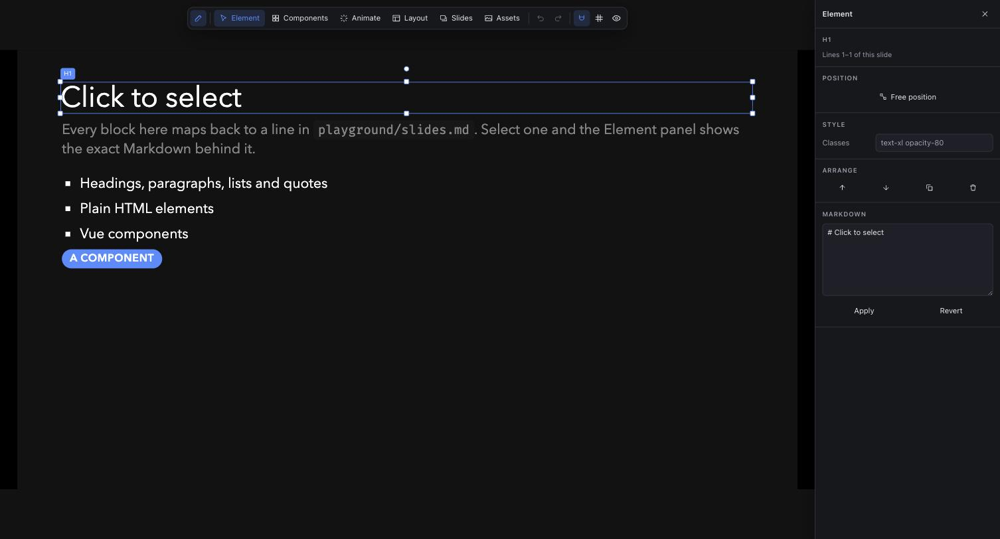

# slidev-addon-studio

A visual editor for [Slidev](https://sli.dev). Select, drag, resize, animate and
compose slides directly on the canvas, the way you would in Keynote or
PowerPoint, while the deck stays exactly what it was: a Markdown file.



**Markdown is the source of truth.** Every action in Studio is a small, readable
edit to your `.md` file. There is no project format, no database and no lock-in.
Close the editor and the diff is something you could have typed by hand. That
constraint is the point: it is what lets a visual editor coexist with version
control, code review and hand editing.

## Install

```bash
pnpm add -D slidev-addon-studio
```

Then enable it in your deck's headmatter:

```yaml
---
addons:
  - slidev-addon-studio
---
```

or in `package.json`, which applies it to every deck in the project:

```json
{
  "slidev": {
    "addons": ["slidev-addon-studio"]
  }
}
```

Start `slidev` as usual and press <kbd>E</kbd>.

## What it does

| Panel | What it edits |
| --- | --- |
| **Element** | Position, size, rotation, utility classes, order, duplicate, delete, and the raw Markdown of the selected block |
| **Components** | Every component this deck can use, with live previews. Click to insert, drag onto the canvas to place freely |
| **Animate** | Click steps, reveal and hide, entrance animations, staggered lists, motion presets, slide transitions |
| **Layout** | The slide's layout, title, classes, background, zoom, click count, and presenter notes |
| **Slides** | Add, duplicate, delete and reorder slides |
| **Assets** | Drop images into `public/` and insert them |

### Selecting and moving

Click anything on the slide. Studio traces the rendered element back to the
exact lines of Markdown it came from and shows them in the Element panel.

Drag the selection and the block leaves the document flow: Studio wraps it in
Slidev's own `v-drag`, so the position is written into the Markdown as
`pos="x,y,w,h"` in slide canvas units. Handles resize, the top handle rotates,
and holding <kbd>Shift</kbd> keeps the aspect ratio or snaps rotation to 15°
steps. "Return to flow" in the Element panel undoes all of it.

Elements snap to the canvas edges, its centre and thirds, and to the edges and
centres of everything else on the slide. Hold <kbd>Alt</kbd> to place something
exactly where you want it instead.

### Animating

Slidev's animation model is a sequence of click steps per slide, so the Animate
panel leads with that sequence and lets you scrub it. Studio writes whichever
form fits the block:

```md
<!-- an element or component takes the directive -->
<Pill v-click.fade="2">Later</Pill>

<!-- a Markdown block gets a wrapper, which renders no extra element -->
<v-click>

# A heading that appears on click

</v-click>

<!-- a list can reveal one item at a time -->
<v-clicks every="2">

- One
- Two

</v-clicks>
```

### Keyboard

| Key | Action |
| --- | --- |
| <kbd>E</kbd> | Open and close Studio |
| <kbd>Esc</kbd> | Deselect |
| <kbd>Ctrl</kbd> + <kbd>Z</kbd> | Undo |
| <kbd>Ctrl</kbd> + <kbd>Shift</kbd> + <kbd>Z</kbd> | Redo |
| <kbd>Alt</kbd> (held) | Bypass snapping while dragging |
| <kbd>Shift</kbd> (held) | Keep aspect ratio, or snap rotation |

Undo history lives in the page, so a reload clears it. Your deck is a file in
git; that is the real undo.

## Making your components palette-friendly

Any component Slidev can resolve shows up in the palette automatically, with a
live preview rendered from the real component. Add an optional metadata block at
the top of an SFC to control how it appears:

```html
<!-- @studio
description: A rounded label
category: Content
snippet: |
  <Pill color="red">Label</Pill>
preview: |
  <Pill color="red">Label</Pill>
-->
```

| Key | Meaning |
| --- | --- |
| `description` | One line shown under the name |
| `category` | Groups the component in the palette; defaults to its package |
| `snippet` | Markup inserted when the component is picked |
| `preview` | Markup rendered in the thumbnail; defaults to `snippet`, or `false` to skip |
| `studio: false` | Keep the component out of the palette entirely |

Without a block, Studio infers a snippet from the component's props and whether
it renders a slot.

## Configuration

All optional, under `studio` in the headmatter:

```yaml
---
studio:
  annotate: all         # all | html | off
  hideComponents:
    - InternalThing
---
```

`annotate` controls how much of the rendered slide carries the source
annotations Studio needs to trace a click back to Markdown:

- `all` (default): HTML elements and Vue components
- `html`: HTML elements only. Use this if a fragment-root component logs
  "extraneous non-props attributes" warnings in your console
- `off`: Markdown blocks only

Studio also respects Slidev's own `editor: false`, which disables it completely.

## How it works

Studio is an ordinary Slidev addon. It hooks into the parts of Slidev that are
already there:

| What it needs | How it gets it |
| --- | --- |
| Editor UI over the deck | `global-top.vue`, teleported to `body` |
| Toolbar button | `custom-nav-controls.vue` |
| Keyboard shortcuts | `setup/shortcuts.ts` |
| Writing to the `.md` | `useDynamicSlideInfo().update()`, the same endpoint Slidev's own editor and `v-drag` use |
| Free positioning | Slidev's `v-drag`, so positions stay compatible with Slidev's own handles |
| Component and layout catalog | `setup/vite-plugins.ts`, which receives the fully resolved options including every theme and addon root |
| Adding and reordering slides | A small dev-only API in the addon's own Vite plugin, since Slidev's endpoint only patches slides in place |
| Tracing a click to its source | A markdown-it plugin that stamps each block with the line range it came from |

That last one is a hint, not a contract. A custom `setup/transformers.ts` can
move lines before markdown-it sees them, so the client re-checks every range
against the real Markdown and finds the block again by its content when the
range does not match. If it cannot be sure, it refuses to edit and says so.
Editing the wrong lines is the one failure that would cost you a deck, and it is
worth being dull about.

## Limitations

- Editing only works while `slidev` is running with the editor enabled. A built,
  exported or printed deck contains none of Studio.
- Slides imported from another file with `src:` can be reordered only within
  their own file.
- The first slide of the entry file cannot be deleted or moved: its frontmatter
  is the deck's global configuration.
- Prop extraction for the palette understands `defineProps` and the Options API.
  Anything more exotic simply shows no props; the component still works.
- If your project sets `slidev.markdown.markdownSetup` in its own Vite config,
  it replaces the addon's and click-to-select stops working. Studio warns on
  startup. Call `studioMarkdownSetup(md)` from your setup to restore it:

  ```ts
  import { studioMarkdownSetup } from 'slidev-addon-studio/node/markdown-source'

  export default {
    slidev: {
      markdown: {
        markdownSetup(md) {
          studioMarkdownSetup(md)
          // your own plugins here
        },
      },
    },
  }
  ```

## Development

```bash
pnpm install
pnpm play        # the playground deck in playground/
pnpm test        # unit tests for the Markdown rewriting
pnpm typecheck
```

The Markdown rewriting lives in `client/md/` and `node/slide-source.ts` as pure
functions with no DOM or Vue involved, which is where the tests are aimed.
Anything that changes a user's file should be provable at that level first.

To try it against a real deck, link it in:

```bash
pnpm add -D "link:../slidev-addon-studio"
```

## License

MIT
